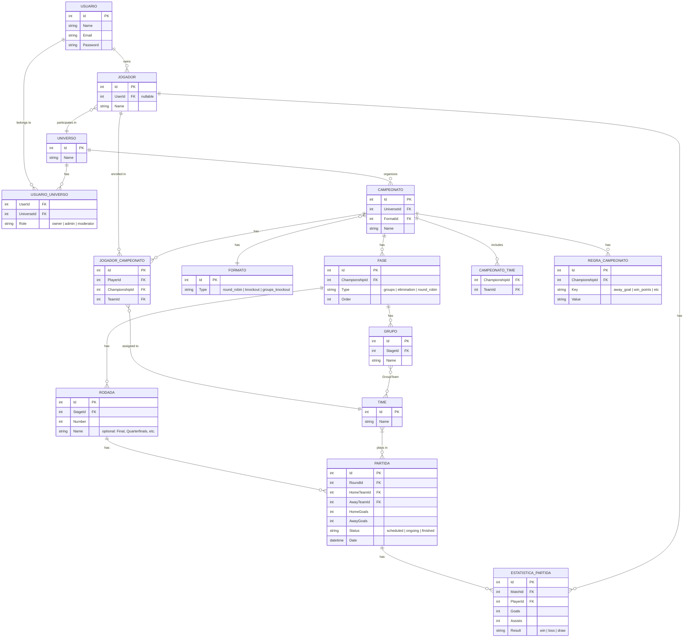

# Database Structure

EasyCup is built around the concept of **Universes** — isolated spaces where administrators can create and manage championships without requiring players to register or accept invitations. Players can optionally link their accounts to track personal stats across championships.

---

## Entity-Relationship Diagram

---

## Entities & Relationships

### User
Represents a registered account on the platform. A user can administer one or more Universes and optionally own Player profiles.

---

### Universe
The top-level scope of the application. A Universe is an isolated space — think of it as a "league organization" — where championships are created and players participate. Administrators manage everything inside a Universe without requiring players to have accounts.

**`UserUniverse`** is the join table between User and Universe. Rather than a simple many-to-many, it carries a `Role` field (`owner`, `admin`, `moderator`) so that multiple users can co-manage a Universe with different levels of permission.

---

### Player
Represents a participant inside a Universe. Players are created and managed by Universe administrators — they do not need to register on the platform.

The `UserId` field is **nullable**: a Player can exist without any linked account. If the real person behind a Player wants to track their own stats, they can register as a User and link their Player profile later. This keeps administration frictionless while still supporting the optional self-service experience.

---

### Championship
A competition organized within a Universe. Each Championship references a `Format` (which determines its overall structure) and can have its own set of configurable rules.

**`ChampionshipTeam`** is the join table that defines the pool of teams available in a given Championship. The same team (e.g. Real Madrid) can appear in multiple championships, and each championship can have any number of teams.

---

### PlayerChampionship
This table is the core of how player-team assignments work. Instead of linking a Player directly to a Team, the assignment is always scoped to a specific Championship. This means the same player can be drawn with Real Madrid in one championship and Manchester United in another, which is exactly how the randomized team draft works.

Each row represents one player enrolled in one championship, along with the team they were assigned to in that championship.

---

### Format
Defines the structural type of a Championship. The three supported types are:

| Type | Description |
|------|-------------|
| `round_robin` | Every team plays against every other team |
| `knockout` | Single-elimination bracket |
| `groups_knockout` | Group stage followed by a knockout phase |

---

### ChampionshipRule
A key-value table that stores configurable rules for each Championship (e.g. `away_goal = true`, `win_points = 3`). Using a key-value structure instead of fixed columns keeps the schema flexible — new rules can be introduced without any migrations.

---

### Stage
A Championship is divided into one or more Stages, each with a `Type` and an `Order`. The `Order` field controls the sequence in which stages are played (e.g. group stage first, then elimination rounds).

| Stage Type | Used in |
|------------|---------|
| `groups` | Groups + Knockout format |
| `elimination` | Knockout and hybrid formats |
| `round_robin` | Round Robin format |

---

### Group
Groups belong to a Stage of type `groups`. Each Group holds a subset of teams (via the `GroupTeam` join table) that play against each other within that group.

---

### Round
A Stage is divided into Rounds. In a round-robin stage, rounds are numbered sequentially. In a knockout stage, rounds have descriptive names (e.g. *Quarterfinals*, *Semifinals*, *Final*).

---

### Match
A Match belongs to a Round and references two teams: `HomeTeam` and `AwayTeam`. It stores the final score and a status field to track whether the match is scheduled, ongoing, or finished.

---

### MatchStatistic
Links a Player directly to a Match, recording individual performance data (goals, assists, result). This is what enables the unified stats view — regardless of which championship or team a player was assigned to, all their match data is stored here and can be queried together.

---

## Championship Format Examples

### Round Robin
- 1 Stage of type `round_robin`
- Rounds numbered sequentially (1, 2, 3…)
- With N teams: N−1 rounds, N/2 matches per round

### Knockout
- 1 Stage of type `elimination`
- 1 Round per bracket step, each with a descriptive name (Quarterfinals, Semifinals, Final)
- Match pairings are determined by the result of the previous round

### Groups + Knockout
- 2 Stages ordered by `Order`:
  1. `groups` Stage — contains Groups, each Group has its own Rounds and Matches
  2. `elimination` Stage — knockout rounds with no groups
- Teams are allocated to Groups via the **GroupTeam** join table